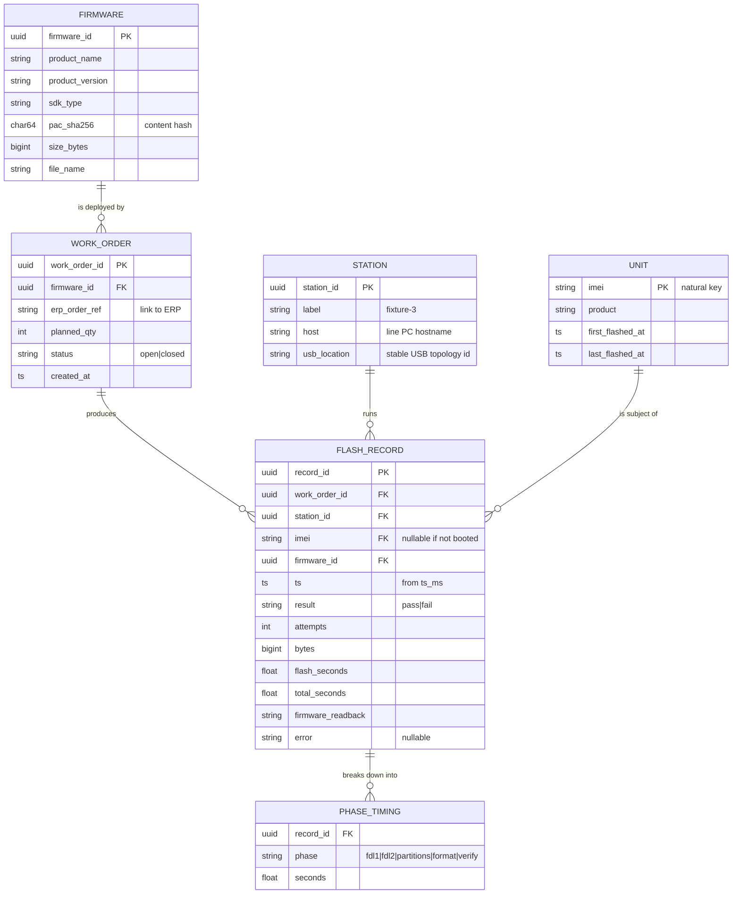
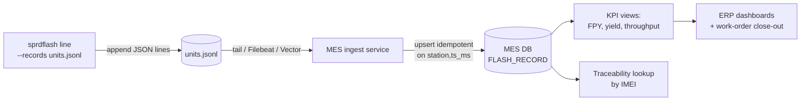

<!--
SPDX-License-Identifier: MIT
SPDX-FileCopyrightText: 2026 Alexander Salas Bastidas <ajsb85@firechip.dev>
-->

# ERP / MES Data Model

This document proposes how the SPRD Flash Tool integrates with a Manufacturing
Execution System (MES) and, above it, an ERP. It defines the **entities**, their
**relationships**, the **KPIs**, and the **ingestion flow**.

## 1. Design principles

1. **The unit record is the source of truth.** The tool emits one immutable JSON
   line per flashed unit (see [unit-record.schema.json](schemas/unit-record.schema.json)).
   The MES ingests those events; it never re-derives them.
2. **Natural key = IMEI.** A booted module reports its IMEI over the AT port, so
   every *passing* unit is traceable to a physical device. Failed units may have
   no IMEI (never booted) and are keyed by `(station, ts)`.
3. **Append-only + idempotent.** Records carry `ts_ms` + `station`; ingestion is
   idempotent on `(station, ts_ms)` so a replayed log never double-counts.
4. **The tool stays dumb, the MES stays smart.** The tool measures and records;
   yield/throughput/traceability rollups live in the MES/ERP.

## 2. Entity–relationship diagram

## 3. Entities

### FIRMWARE
The `.pac` being deployed. Uniquely identified by its **content hash**
(`pac_sha256`) so two builds with the same product name are distinguishable and
a mis-loaded PAC is caught. `product_name`, `product_version`, and `size_bytes`
come straight from the PAC header the tool already parses; `sdk_type` is derived
(`LuatOS` vs `CSDK` …) for cross-SDK tracking.

### WORK_ORDER
An instruction to flash a quantity of units with one firmware, linked to the ERP
production order (`erp_order_ref`). The tool is invoked per work order; the work
order id is supplied to the run (env/CLI) and stamped onto every record.

### STATION
A physical fixture. `usb_location` (USB topology path, stable across reboots) is
the durable identity — COM/tty names are **not** stable and must not be used as a
key. `label` is the human name shown on the line.

### UNIT
The physical module, keyed by **IMEI**. One unit accrues many flash records over
its life (rework, re-flash, RMA). `first/last_flashed_at` bound its history.

### FLASH_RECORD
The atomic event — one row per `sprdflash` unit attempt, mapped 1:1 from the
emitted JSON line (§5). This is what the tool produces.

### PHASE_TIMING
Per-phase breakdown (`fdl1`, `fdl2`, `partitions`, `format`, `verify`) for line
balancing and bottleneck analysis. Every record carries it in the `phases[]`
array, alongside the overall `flash_seconds`/`total_seconds`; the
`v_event_phase_avg` view rolls it up per phase.

## 4. KPIs (derived by the MES/ERP)

| KPI | Definition |
|-----|------------|
| **First-Pass Yield (FPY)** | `count(result=pass AND attempts=1) / count(distinct unit)` |
| **Yield** | `count(pass) / count(total attempts)` |
| **Throughput** | good units per hour, per station and per line |
| **Cycle time** | `avg(total_seconds)` (flash + verify + recovery) |
| **Flash time** | `avg(flash_seconds)` — pure transfer, for capacity planning |
| **Retry rate** | `count(attempts>1) / count(total)` |
| **Station availability** | uptime − recovery time, per `station_id` |
| **Top defects** | `error` grouped and ranked (Pareto) |
| **Traceability** | for any IMEI: every firmware + timestamp it ever ran |

## 5. Field mapping: tool → FLASH_RECORD

| JSON field (tool) | FLASH_RECORD column | Notes |
|-------------------|---------------------|-------|
| `ts_ms`           | `ts`                | epoch ms → `timestamptz` |
| `station`         | `station_id`        | resolved via `STATION.label`/`usb_location` |
| `port`            | (attribute)         | diagnostic only, not a key |
| `product`         | → `FIRMWARE`        | with `pac` + hash to resolve `firmware_id` |
| `pac`             | → `FIRMWARE.file_name` | |
| `result`          | `result`            | `pass` / `fail` |
| `attempts`        | `attempts`          | 1 = first-pass |
| `bytes`           | `bytes`             | payload written |
| `flash_seconds`   | `flash_seconds`     | |
| `total_seconds`   | `total_seconds`     | |
| `firmware`        | `firmware_readback` | ATI banner from the booted unit |
| `imei`            | `imei`              | natural key of `UNIT` (nullable on fail) |
| `error`           | `error`             | nullable; drives the defect Pareto |

## 6. Ingestion flow

- **Transport:** the JSON-lines file is tailed by any log shipper (Filebeat,
  Vector, Fluent Bit) or ingested in bulk at shift end. No custom protocol.
- **Idempotency:** ingestion upserts on `(station_id, ts_ms)`.
- **Back-pressure / offline:** the file is the buffer; the line keeps running if
  the MES is down and catches up on reconnect.

See [schemas/mes-postgres.sql](schemas/mes-postgres.sql) for the concrete DDL and
KPI views.
